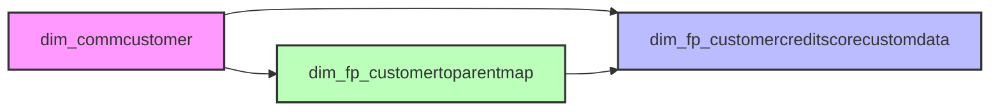

# Customer Code Mapping Guide

## Overview

This guide provides comprehensive documentation for understanding and implementing customer code mappings in the Yardi Power BI solution. Customer codes are business-friendly identifiers (c0000xxx format) that provide consistent identification across reports and analytics.

## Table Architecture

### Primary Tables Involved



### 1. dim_commcustomer (Primary Tenant Table)
- **Purpose**: Master table for all tenant/customer entities
- **Key Fields**:
  - `tenant_id`: Unique tenant identifier (system-generated)
  - `customer_id`: Customer identifier (links to other tables)
  - `tenant_code`: Technical tenant code (t0000xxx format)
  - `lessee_name`: Legal entity name

### 2. dim_fp_customercreditscorecustomdata (Credit & Company Data)
- **Purpose**: Credit scores and enhanced company information
- **Key Fields**:
  - `hmyperson_customer`: Links to dim_commcustomer.customer_id
  - `customer code`: Business-friendly code (c0000xxx format)
  - `customer name`: Enhanced company name
  - `credit score`: Risk assessment (0-10 scale)
  - Additional company data (revenue, industry, etc.)

### 3. dim_fp_customertoparentmap (Corporate Structure)
- **Purpose**: Maps subsidiaries to parent companies
- **Key Fields**:
  - `customer hmy`: Links to dim_commcustomer.customer_id
  - `customer code`: Business-friendly code (c0000xxx format)
  - `customer name`: Company name
  - `parent customer hmy`: Links to parent company

## Relationship Diagram

```
dim_commcustomer
    │
    ├── customer_id ──→ hmyperson_customer (dim_fp_customercreditscorecustomdata)
    │                   Returns: customer code, enhanced name, credit score
    │
    └── customer_id ──→ customer hmy (dim_fp_customertoparentmap)
                        Returns: customer code, name, parent relationship
```

## Lookup Logic and Priority

### Step-by-Step Lookup Process

1. **Start with dim_commcustomer**
   - Get the `customer_id` for the tenant
   - This is your primary join key

2. **Check dim_fp_customercreditscorecustomdata (Primary Source)**
   - Join on: `customer_id = hmyperson_customer`
   - Retrieve: customer code, customer name, credit score
   - This is the preferred source when available

3. **Check dim_fp_customertoparentmap (Secondary Source)**
   - Join on: `customer_id = customer hmy`
   - Retrieve: customer code, customer name, parent info
   - Use when not found in credit scores table

4. **Fallback to dim_commcustomer**
   - Use `lessee_name` when no match in other tables
   - Always available for all tenants

## DAX Implementation Patterns

### Basic Customer Code Lookup

```dax
Customer Code Lookup = 
VAR CustomerID = SELECTEDVALUE(dim_commcustomer[customer id])
VAR CreditCode = 
    LOOKUPVALUE(
        dim_fp_customercreditscorecustomdata[customer code],
        dim_fp_customercreditscorecustomdata[hmyperson_customer], 
        CustomerID
    )
VAR ParentCode = 
    LOOKUPVALUE(
        dim_fp_customertoparentmap[customer code],
        dim_fp_customertoparentmap[customer hmy], 
        CustomerID
    )
RETURN 
    COALESCE(CreditCode, ParentCode)
```

### Enhanced Customer Name with Fallback

```dax
Customer Name Enhanced = 
VAR CustomerID = SELECTEDVALUE(dim_commcustomer[customer id])
VAR CreditName = 
    LOOKUPVALUE(
        dim_fp_customercreditscorecustomdata[customer name],
        dim_fp_customercreditscorecustomdata[hmyperson_customer], 
        CustomerID
    )
VAR ParentName = 
    LOOKUPVALUE(
        dim_fp_customertoparentmap[customer name],
        dim_fp_customertoparentmap[customer hmy], 
        CustomerID
    )
VAR LesseeName = SELECTEDVALUE(dim_commcustomer[lessee name])
RETURN 
    COALESCE(CreditName, ParentName, LesseeName)
```

### Credit Score with Parent Inheritance

```dax
Customer Credit Score with Parent = 
VAR CustomerID = SELECTEDVALUE(dim_commcustomer[customer id])
// Try direct credit score
VAR DirectScore = 
    LOOKUPVALUE(
        dim_fp_customercreditscorecustomdata[credit score],
        dim_fp_customercreditscorecustomdata[hmyperson_customer], 
        CustomerID
    )
// Get parent ID if subsidiary
VAR ParentID = 
    LOOKUPVALUE(
        dim_fp_customertoparentmap[parent customer hmy],
        dim_fp_customertoparentmap[customer hmy], 
        CustomerID
    )
// Get parent's credit score
VAR ParentScore = 
    IF(
        NOT ISBLANK(ParentID),
        LOOKUPVALUE(
            dim_fp_customercreditscorecustomdata[credit score],
            dim_fp_customercreditscorecustomdata[hmyperson_customer], 
            ParentID
        )
    )
RETURN 
    COALESCE(DirectScore, ParentScore)
```

## Common Use Cases

### 1. Display Customer with Code in Reports

```dax
Customer Display = 
VAR Code = [Customer Code Lookup]
VAR Name = [Customer Name Enhanced]
RETURN 
    IF(
        NOT ISBLANK(Code),
        Code & " - " & Name,
        Name
    )
// Example Output: "c0000123 - ABC Corporation"
```

### 2. Filter High-Risk Tenants

```dax
High Risk Tenants = 
CALCULATETABLE(
    dim_commcustomer,
    FILTER(
        dim_commcustomer,
        VAR CustomerID = dim_commcustomer[customer id]
        VAR Score = 
            LOOKUPVALUE(
                dim_fp_customercreditscorecustomdata[credit score],
                dim_fp_customercreditscorecustomdata[hmyperson_customer],
                CustomerID
            )
        RETURN Score < 4 || ISBLANK(Score)
    )
)
```

### 3. Count Customers by Data Source

```dax
Customer Code Coverage = 
VAR TotalCustomers = COUNTROWS(dim_commcustomer)
VAR WithCodes = [Count Customers with Codes]
RETURN 
    DIVIDE(WithCodes, TotalCustomers, 0)
    // Returns percentage with customer codes
```

## Business Rules and Considerations

### Data Consistency
- Customer codes are unique across the system
- When a customer exists in both credit and parent tables, codes are consistent
- Customer codes follow format: c0000001, c0000002, etc.

### Coverage Expectations
- Not all customers have customer codes
- Customer codes indicate credit assessment has been performed
- Parent companies typically have codes even if subsidiaries don't

### Performance Considerations
- LOOKUPVALUE is optimized for single value lookups
- For bulk operations, consider using RELATED if relationships exist
- Cache frequently used lookups in calculated columns if appropriate

## Troubleshooting Guide

### Issue: Customer Code Not Found
**Check:**
1. Verify customer_id exists in dim_commcustomer
2. Check if customer_id exists in credit scores table
3. Check if customer_id exists in parent map table
4. Confirm data refresh has been completed

### Issue: Inconsistent Names
**Check:**
1. Compare names across all three tables
2. Verify which source is being used (credit vs parent vs lessee)
3. Check for data quality issues in source tables

### Issue: Missing Credit Scores
**Check:**
1. Verify if customer has direct credit score
2. Check if customer is subsidiary with parent score
3. Confirm credit assessment has been performed

## Python Implementation Example

```python
import pandas as pd

def get_customer_code(customer_id, credit_df, parent_df):
    """
    Retrieve customer code with priority logic
    """
    # Check credit scores table first
    credit_match = credit_df[credit_df['hmyperson_customer'] == customer_id]
    if not credit_match.empty:
        return credit_match.iloc[0]['customer code']
    
    # Check parent map table second
    parent_match = parent_df[parent_df['customer hmy'] == customer_id]
    if not parent_match.empty:
        return parent_match.iloc[0]['customer code']
    
    return None  # No code found

# Example usage
customer_codes = []
for cust_id in customer_ids:
    code = get_customer_code(cust_id, credit_scores_df, parent_map_df)
    customer_codes.append(code)
```

## Best Practices

1. **Always Use Priority Logic**
   - Check credit scores table first
   - Fall back to parent map table
   - Use dim_commcustomer as final fallback

2. **Handle NULL Values Gracefully**
   - Use COALESCE or ISNULL in DAX
   - Provide meaningful defaults
   - Don't assume all customers have codes

3. **Maintain Data Quality**
   - Regular validation of customer codes
   - Check for duplicates or inconsistencies
   - Monitor coverage metrics

4. **Document Exceptions**
   - Track customers without codes
   - Document reason for missing data
   - Plan for data enrichment

## Reference Tables Summary

| Table | Join Key | Returns | Coverage |
|-------|----------|---------|----------|
| dim_fp_customercreditscorecustomdata | customer_id = hmyperson_customer | customer code, name, credit score | Subset with credit data |
| dim_fp_customertoparentmap | customer_id = customer hmy | customer code, name, parent | Subset with corporate structure |
| dim_commcustomer | Direct | lessee_name | All customers |

## Related Documentation

- [Data Model Guide](../Claude_AI_Reference/Documentation/02_Data_Model_Guide.md)
- [Data Dictionary](../Claude_AI_Reference/Documentation/03_Data_Dictionary.md)
- [Customer Code Mapping DAX Measures](../Claude_AI_Reference/DAX_Measures/06_Customer_Code_Mapping_Measures.dax)
- [Credit Risk Analysis Measures](../Claude_AI_Reference/DAX_Measures/03_Credit_Risk_Tenant_Analysis_Measures_v5.0.dax)

---

*Last Updated: 2025-08-10*
*Version: 1.0*